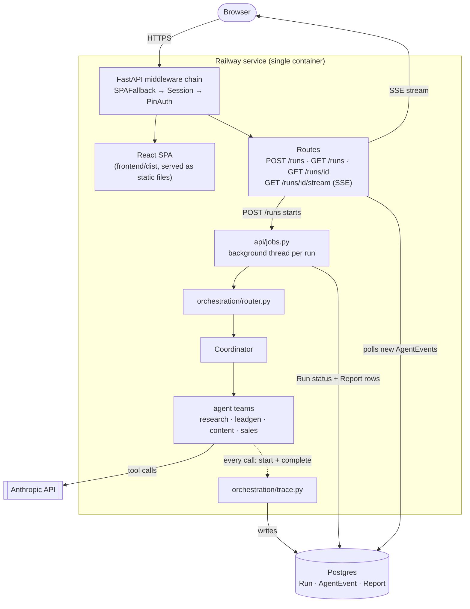

# Growth Agent Orchestrator

A multi-agent system for SynapsesAI that turns a plain-English growth goal
into research, qualified leads, content, and outreach drafts.

## Architecture



One Railway service serves everything. The browser talks to FastAPI over
plain HTTPS — the same origin serves the React SPA's static files, the JSON
API, and the SSE stream, so there's no CORS to configure. `POST /runs`
starts a background thread (`api/jobs.py`) that runs the same
`orchestration.run` pipeline the CLI uses; every agent call writes a
`started`/`completed` row to Postgres as it happens, which is what lets the
SSE endpoint poll for genuinely live progress rather than replaying a log
after the fact. A CLI entrypoint (`cli.py`) exists alongside the web app,
reusing the identical agents/orchestration and writing to local
`runs/<id>/` files instead of Postgres — not pictured above since it
bypasses the whole API layer, but it's the same orchestration underneath.

## How it works

You give the CLI a goal, e.g.:

```
python cli.py "find 10 leads in the legal sector, Gauteng"
```

The **Coordinator** (`agents/coordinator.py`) parses the goal, routes it to
the relevant teams (`orchestration/router.py`), runs each team's agent
pipeline, and assembles a final report:

- **Research** — `researcher` (web search) → `synthesizer` (structured market brief)
- **Leadgen** — `prospector` (web search) → `qualifier` (ICP scoring)
- **Content** — `strategist` → `writer` → `critic` (revision loop, up to 2 passes)
- **Sales** — `outreach_drafter` (uses leads + content output)

Every agent call goes through `agents/base.py`'s `Agent.call()`, which logs
timestamp, input, output, tool calls, and duration to a shared `Trace`
(`orchestration/trace.py`). Handoffs between agents/teams are logged too.

Business context (SynapsesAI's services, ICP, differentiators, funnel) lives
in one place: `context/business_profile.py`. Every agent's system prompt is
built from it, so updating the business profile updates every agent.

## Setup

```
pip install -r requirements.txt
cp .env.example .env   # then fill in the values below
```

## Run (CLI)

```
python cli.py "write 3 LinkedIn posts about AI adoption for SA manufacturers"
```

Each run is saved under `runs/<run_id>/`:
- `goal.txt` — the original goal
- `report.md` — the final assembled report
- `trace.json` — full trace of every agent call and handoff

## Run (web app)

The `api/` module wraps the same orchestrator in a FastAPI app (Postgres-backed
run history, live SSE progress, PIN-gated) with a React frontend in `frontend/`.

Local dev runs backend and frontend as two processes:

```
python -m uvicorn api.main:app --reload      # backend, http://127.0.0.1:8000
cd frontend && npm install && npm run dev    # frontend, http://localhost:5173
```

Vite's dev server proxies `/runs`, `/login`, `/health` to the backend (see
`frontend/vite.config.ts`), so open the frontend URL, not the backend one.
See `frontend/README.md` for details.

For a single-process deployment (one server serving both the API and the
built frontend), see **Deployment** below.

## How I use this

This runs SynapsesAI's actual growth work, mostly through the web UI now
that it's deployed rather than the CLI. A few goals I've actually run
through it:

- **"find 10 leads in the legal services sector, Gauteng"** — a
  prospecting pass for a specific vertical. I only reach out to the
  "yes"/"maybe" leads, and only after manually verifying anything the
  Qualifier flagged as uncertain (headcount near the ICP floor, site count
  near the ceiling) — the fit scores are a triage tool, not a decision.
- **"write 3 LinkedIn posts about AI adoption for SA accounting firms"** —
  a content batch for one vertical before doing outreach to that same
  vertical, so the public content and the outreach are saying the same
  thing when a prospect checks the company page.
- **"find prospects in the legal services sector, Gauteng and draft
  outreach for the best ones"** — the full pipeline in one goal: Lead Gen
  feeds Sales directly, and I get a batch of draft emails, every one
  explicitly marked `DRAFT — for human review before sending`, that I
  personalize before actually sending anything.
- **"research market trends for POPIA compliance"** — a standalone
  research pass before entering a new vertical, to ground content and
  outreach messaging in something more specific than generic AI-adoption
  talk.

I treat every output as a first draft, not a send-ready asset. That's not
just caution — the Critic's revision loop and the outreach draft markers
exist because keeping a human in the loop before anything reaches a client
is the same principle SynapsesAI sells to its own clients (see
[Why draft-only outputs](#why-draft-only-outputs-never-auto-send) below);
it would be a strange tool to build for the business if it didn't hold
itself to that.

## Project structure

```
agents/
    base.py                 # shared Agent class
    coordinator.py           # routes goal to teams, assembles final report
    research/                # researcher, synthesizer
    leadgen/                 # prospector, qualifier
    content/                 # strategist, writer, critic
    sales/                   # outreach_drafter
orchestration/
    router.py                # keyword-based team routing
    trace.py                 # call/handoff logging; also mirrors agent
                              # start/complete events to Postgres
    run.py                   # entrypoint used by cli.py and api/jobs.py
context/
    business_profile.py      # SynapsesAI brand/ICP/services, shared context
api/
    main.py                  # FastAPI app: PIN auth, serves the built SPA
    db.py                    # Postgres connection (DATABASE_URL)
    models.py                # Run, AgentEvent, Report (SQLAlchemy)
    jobs.py                  # runs orchestration.run as a background job
    migrations/               # Alembic
    routes/
        runs.py               # POST/GET /runs, GET /runs/{id}
        stream.py             # GET /runs/{id}/stream (SSE)
frontend/                    # React (Vite + TS + Tailwind) UI — see frontend/README.md
runs/                        # timestamped output per CLI invocation
cli.py                       # `python cli.py "<goal>"`
railway.toml, nixpacks.toml  # single-service Railway deployment config
```

## Environment variables

Set in `.env` for local dev; set the same names as real environment
variables (not in a `.env` file) when deploying.

| Variable | Required | Notes |
|---|---|---|
| `ANTHROPIC_API_KEY` | Yes | https://console.anthropic.com/settings/keys |
| `ANTHROPIC_MODEL` | No | Overrides the default model for all agents |
| `DATABASE_URL` | Yes (for `api/`) | Postgres connection string. On Railway, provision a Postgres plugin in the same project and reference its `DATABASE_URL` — see Deployment below |
| `APP_PIN` | Yes (for `api/`) | The shared PIN required to sign in. **Use a real value in production** — `.env.example`'s placeholder (`2468`) is for local testing only, never deploy with it |
| `SESSION_SECRET_KEY` | Yes (for `api/`) | Signs the session cookie. Generate one with `python -c "import secrets; print(secrets.token_hex(32))"` — a long random string, not something memorable |
| `SESSION_HTTPS_ONLY` | No | Set to `true` once served over HTTPS (Railway's default domains are HTTPS, so set this to `true` in production) |

## Deployment (Railway, single service)

FastAPI serves both the API and the built React app from one process — no
separate frontend host, no CORS to configure.

1. **Create the Railway project** (or use an existing one) and add a
   Postgres plugin to it if you don't already have one — this provisions
   `DATABASE_URL` automatically as a project-level reference.
2. **Create a service** from this repo (GitHub repo or `railway up` from
   the CLI). Railway will pick up `railway.toml` and `nixpacks.toml`
   automatically:
   - `nixpacks.toml` installs Python + Node, creates a venv at `/opt/venv`
     (nixpkgs' `python312` doesn't bundle pip; bootstrapping via
     `ensurepip` into a venv sidesteps Nix's pip packaging entirely),
     installs `requirements.txt` into it, and runs `npm install` +
     `npm run build` in `frontend/`.
   - `railway.toml` sets the start command to activate that same venv,
     run `alembic upgrade head` (applying any pending migrations), and
     then start `uvicorn`, plus a `/health` healthcheck and an
     on-failure restart policy.
3. **Set environment variables** on the service (Settings → Variables):
   - `DATABASE_URL` — reference the Postgres plugin's variable (Railway
     lets you reference `${{Postgres.DATABASE_URL}}` from another plugin
     in the same project, rather than hardcoding it)
   - `ANTHROPIC_API_KEY`
   - `APP_PIN` — a real PIN, not `2468`
   - `SESSION_SECRET_KEY` — generate with the command above
   - `SESSION_HTTPS_ONLY=true`
4. **Deploy.** Watch the build logs for the `npm run build` step and the
   `alembic upgrade head` line in the start logs — if either fails, the
   deploy will show it clearly.
5. **Open the service's Railway-provided domain.** You should land on the
   login page; enter `APP_PIN` to get in.

This has been deployed to a live Railway project — the build config went
through several real failures on the way (nixpkgs' `python312` not
aliasing `pip`, then not bundling `pip` at all, then Vite 8's default
bundler breaking cross-platform native binary resolution). Each is written
up under **Design decisions → Bug stories** below, since they're more
useful there as "what actually went wrong and why" than as a changelog.

## Design decisions

### Why custom orchestration over a framework

The whole system is a dozen or so small classes: an `Agent` base class, a
keyword router, a `Coordinator`, and per-team pipelines. A framework's
abstractions (chains, crews, graph executors) would add a layer of
indirection for control flow I can write directly in plain Python — a
`for` loop over teams, a `while` loop for the Critic's revision cycle.
Hand-rolling it means every piece of control flow is visible and
debuggable without learning framework-specific concepts, and it made the
Postgres-backed live tracing and the SSE stream straightforward to add
later, since there was no framework runtime sitting between "an agent call
happens" and "log it."

### Why draft-only outputs (never auto-send)

Every outreach message is explicitly labeled `DRAFT — for human review
before sending`, and the Writer/Critic revision loop exists to raise
quality before a human sees a draft, not to reach a state where sending
happens without one. This mirrors SynapsesAI's own positioning —
human-in-the-loop, not autonomous or black-box — and it would undercut
that story to build internal growth tooling that skips the human step it
sells to clients. Practically, it also bounds the blast radius of a bad
output to a wasted few seconds of review, not a client-facing mistake with
SynapsesAI's name on it.

### Why SSE over WebSockets

Progress only flows one direction, server to browser — `RunView` never
needs to send anything back over the open connection; the one action a
user takes (starting a run) is already a regular `POST /runs`. WebSockets
would mean a bidirectional protocol, a different client API, and
reconnect/heartbeat logic for a use case that's a strict subset of what
SSE already does natively: browser auto-reconnect, plain HTTP (no `ws://`
upgrade to worry about behind a proxy), and a five-line `EventSource`
client. The stream also has a natural end — the server sends one final
`run_status` event and closes — which maps directly onto SSE's model and
would just be extra state to manage over a persistent bidirectional
socket.

### Why Postgres-backed trace logging over the original JSON files

The first version wrote one `trace.json` per run, built up in memory and
saved once at the end — fine for the CLI, but it can't support "watch a
run live," since there's nothing to read until the run is already over.
Every agent call now writes a `started` row and a `completed` row to
Postgres (`AgentEvent`) *as it happens*, which is what actually makes the
SSE endpoint possible — it just polls for rows newer than the last one it
sent. The CLI's local `trace.json` still exists for anyone not using the
web app (`Trace` writes to both), and the Postgres writes are wrapped to
fail soft, so a missing `DATABASE_URL` degrades to CLI-only behavior
instead of breaking the run.

### Why one Railway service instead of two

FastAPI serves the built React app's static files directly rather than
deploying frontend and backend as separate Railway services. Two services
would mean a second domain, CORS configuration, and — the part that
actually matters here — the PIN-auth session cookie would need
`SameSite=None; Secure` to cross origins, real complexity for zero
benefit, since nothing else consumes this API and there's no reason for
the frontend to live anywhere the backend doesn't. One service, one
origin, and the session cookie just works with `SameSite=Lax` and no CORS
headers at all.

The one real cost of that choice is a routing collision: several frontend
client-side routes are byte-for-byte identical to backend API paths —
`GET /runs/{id}` is both the JSON endpoint *and* the URL of the React
`RunView` page. `api/main.py`'s `SPAFallbackMiddleware` resolves this by
checking the request's `Accept` header *before routing happens*: a browser
page navigation (`Accept: text/html`) gets the SPA shell
(`frontend/dist/index.html`) regardless of path; everything else — the
frontend's own `fetch()` calls (`Accept: application/json`) and the SSE
stream (`Accept: text/event-stream`) — passes through to the real routes.
`PinAuthMiddleware` then only guards the `/runs` API prefix; the SPA
shell, its static assets, and `/login`/`/health` are always public, so the
app can load and show its own login screen before a session exists. (See
the next two bug stories for how this fix actually got found and then
needed a second fix.)

### Bug stories

**Structured-output retry.** `Agent.call_structured()` forces Claude to
respond via a tool call matching a Pydantic schema, but the model doesn't
always honor schema constraints strictly — a JSON Schema `minItems: 2` on
an array is a hint to the model, not an enforced constraint on what it
generates. Caught by a real failed run during testing: the Content team's
Strategist returned exactly one content angle when the schema required
two to three, raising a `ValidationError` and marking the whole `Run` as
`failed`. Fix: `call_structured()` catches the `ValidationError` and
retries once, re-prompting with the exact validation error appended and
asking the model to correct it. Both attempts are logged to the trace (the
failed one prefixed `INVALID:`), so a retry is visible in the
`AgentTimeline` rather than silently hidden.

**Dev-proxy routing collision.** The first appearance of the
`/runs/{id}`-is-both-a-page-and-an-endpoint problem described above.
Clicking between pages inside the running app worked fine (client-side
`<Link>` navigation never hits the server), which is exactly why a hard
refresh on `/runs/{id}` was the case that exposed it: Vite's dev proxy
forwarded *any* request under `/runs` straight to the backend, so a
browser wanting the SPA shell got the raw JSON API response instead. Fix:
the proxy's `bypass` checks the `Accept` header — `text/html` skips the
proxy and lets Vite serve the SPA; anything else proxies through as
normal.

**Prod cache-based recurrence of the same bug.** Porting that fix to
production as `SPAFallbackMiddleware` (same Accept-header logic, running
pre-routing since a route registered after the API routes would never
even see the collision) checked out in isolated `curl` tests — but a real
browser hard-refresh on `/runs/{id}` threw `Unexpected token '<',
"<!doctype "... is not valid JSON`. `FileResponse` sets `ETag`/
`Last-Modified` by default with no `Vary` header, so the browser's HTTP
cache treated `/runs/{id}` as one cacheable resource keyed by URL alone —
the initial HTML navigation got cached, and `RunView`'s subsequent
`fetch()` to the *identical URL* with a different `Accept` header was
served the cached HTML instead of hitting the network. The same root bug,
resurrected by a mechanism (browser caching) the dev-proxy fix never had
to account for, since Vite's dev server doesn't get cached the same way.
Fix: `Cache-Control: no-store` plus `Vary: Accept` on the SPA-shell
response.

**The three Nixpacks/pip deployment fixes.** Railway deploys surfaced
three genuinely separate build issues in sequence, not one problem taking
three attempts to fix:

1. `pip: command not found` — nixpkgs' `python312` package doesn't alias a
   plain `pip` on the build image. Fixed with `python -m pip`.
2. That then failed with `No module named pip` — nixpkgs' `python312`
   doesn't bundle pip at all (it's packaged separately as
   `python312Packages.pip`), and declaring that package alongside it
   didn't reliably resolve into the active Nix profile for that build's
   nixpkgs snapshot. Fixed by sidestepping Nix's pip packaging entirely:
   create a venv, bootstrap pip into it via `ensurepip` (part of the
   Python standard library, no Nix package needed), install everything
   into that venv, and activate it in both the install phase and the
   start command.
3. The frontend build then failed with a missing
   `@rolldown/binding-linux-x64-gnu` native binary. This one took three
   attempts to actually diagnose (`npm ci` → `npm install` → untracking
   the committed lockfile entirely, each hitting the *exact same error*)
   before stepping back to check what had actually changed upstream
   instead of continuing to guess at npm flags: `vite@8.2.2`'s default
   bundler is Rolldown, a new Rust-based bundler whose per-platform
   optional-dependency npm packaging is currently broken across
   platforms — confirmed directly against the npm registry
   (`vite@8.2.2` depends on `rolldown`; `vite@7.3.6` depends on the
   mature, battle-tested `rollup`). The identical error on every attempt
   was the signal that this wasn't a local config problem at all. Fixed
   by downgrading to Vite 7.3.6, paired with `@vitejs/plugin-react@5.2.0`
   since the version already in use peer-locks to `vite ^8.0.0` only.
